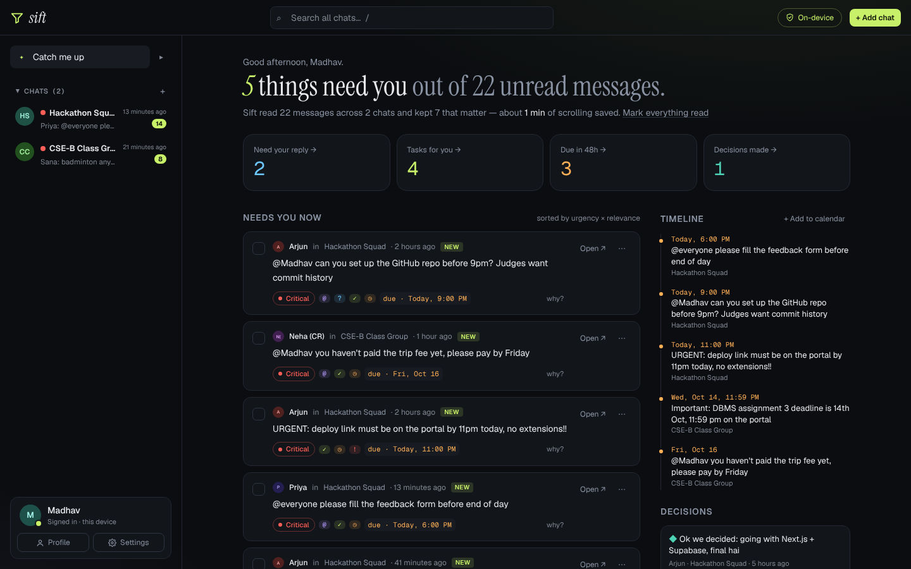
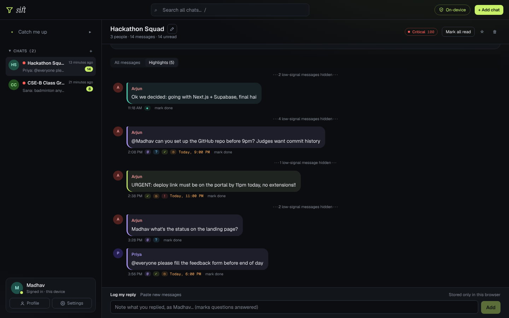
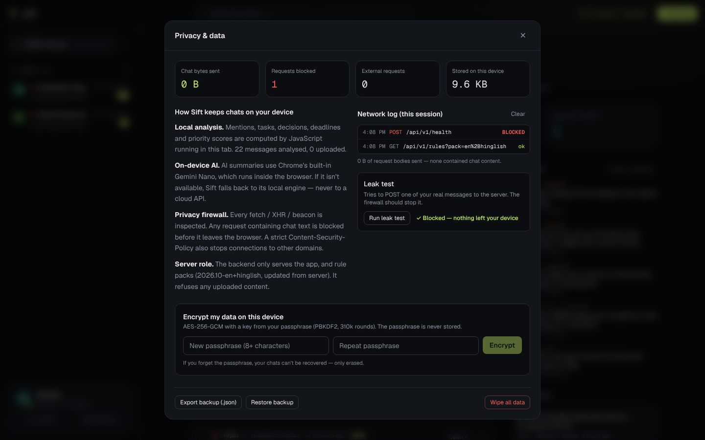
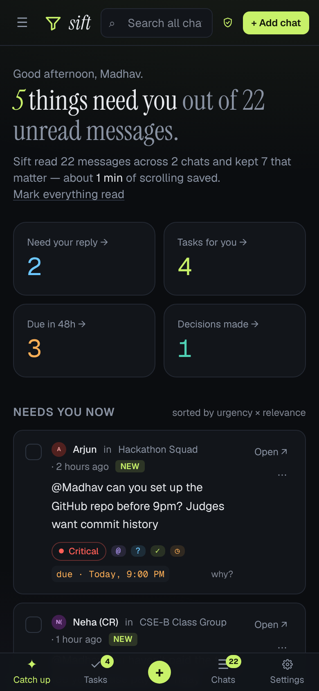
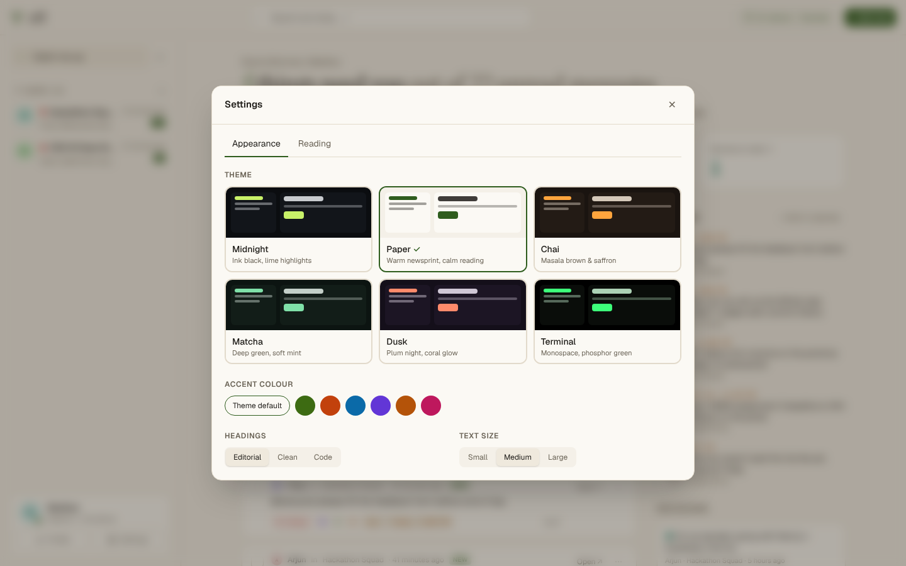
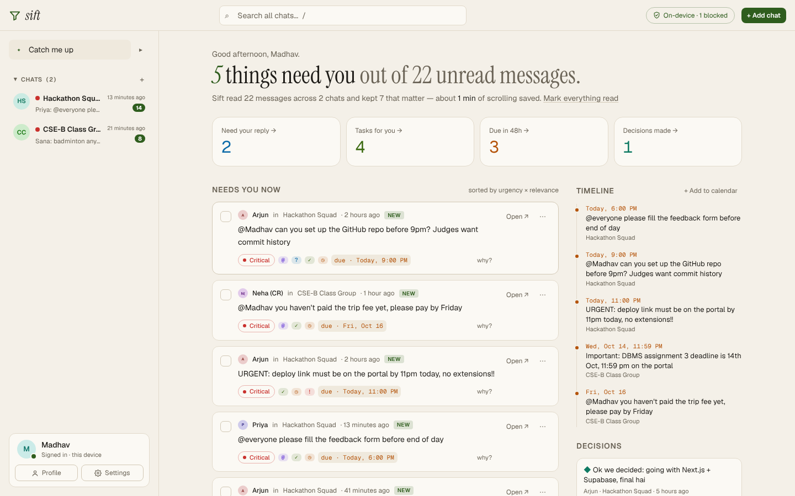

# Sift — catch up on chats, privately

[](https://github.com/madhavtg2008-cyber/sift-hackathon-/actions/workflows/ci.yml)

**200 unread messages. One of them is your deadline.** Sift reads your group chats and pulls out the mentions, questions, decisions, deadlines and tasks you missed, ranked by urgency and relevance. **Everything runs on your device — conversations and summaries never leave the browser, and the app proves it.**



## At a glance

| Area                        | What's in the repo                                                                                                                                                                                                                                                                                               | Proof                                                                                                                                       |
| --------------------------- | ---------------------------------------------------------------------------------------------------------------------------------------------------------------------------------------------------------------------------------------------------------------------------------------------------------------- | ------------------------------------------------------------------------------------------------------------------------------------------- |
| **Innovation**              | Local-first chat triage with explainable 0–100 priority scores; English + Hinglish deadline understanding ("kal subah 8 baje"); on-device Gemini Nano summaries; **Share to Sift** from WhatsApp (PWA share target); privacy firewall with a live leak test; local deadline reminders and `.ics` calendar export | [`engine.ts`](src/lib/engine.ts), [`dates.ts`](src/lib/dates.ts), [`public/sw.js`](public/sw.js), [`netguard.ts`](src/lib/netguard.ts)      |
| **Code quality**            | TypeScript strict; ESLint + Prettier enforced in CI and builds; **89 unit/API tests** + **12 Playwright E2E tests**; **91.6 % line coverage** of logic layers with CI thresholds; shared zod contracts                                                                                                           | [`tests/`](tests), [`e2e/`](e2e), [`docs/TESTING.md`](docs/TESTING.md), [CI](.github/workflows/ci.yml)                                      |
| **UI / UX & impact**        | Ranked "Needs you now", timeline, decisions; undo for every action; 6 themes; mobile tab bar; keyboard shortcuts; first-run export guide; **0 WCAG 2.1 A/AA violations** (axe)                                                                                                                                   | [`e2e/a11y.spec.ts`](e2e/a11y.spec.ts), [screenshots](#screenshots)                                                                         |
| **Backend & architecture**  | Versioned **`/api/v1`** with **OpenAPI 3.1**, zod validation on server _and_ client, **rate limiting** (`RateLimit-*`), **RFC 9457** errors, request IDs, ETag/304; per-request CSP nonces in middleware; analysis in a **Web Worker** for large inboxes; windowed rendering; layered design                     | [`docs/ARCHITECTURE.md`](docs/ARCHITECTURE.md), [`src/server/`](src/server), [`/api/v1/openapi.json`](src/app/api/v1/openapi.json/route.ts) |
| **Security & optimisation** | Optional **AES-256-GCM** encrypted storage (PBKDF2 310k); nonce-based CSP without `unsafe-inline` scripts; HSTS, COOP/CORP, X-Frame-Options; code-split dialogs and lazy validation keep first-load JS at **138 kB** (164 kB without splitting); 4 000-message chat opens in ~0.45 s                             | [`vault.ts`](src/lib/vault.ts), [`csp.ts`](src/lib/csp.ts)                                                                                  |

## How it works

1. **Bring a chat** — WhatsApp → ⋮ → More → **Export chat** → **Without media** → share to **Sift** (Android) or upload the `.txt`/`.zip`. Slack/JSON and pasted text work too. Files are read with the File API and never uploaded.
2. **Sift analyses it on the device** — every message is checked for mentions of you, questions to you, tasks, decisions, deadlines and urgency, then scored by urgency × relevance (deadline proximity, unanswered questions, VIP senders, your keywords).
3. **Catch up in seconds** — "N things need you out of M unread", a ranked list with a plain-language **why?** for every item, a deadline timeline, decisions, and missed mentions. Tick things off, snooze, export deadlines to your calendar, or jump to the exact message.

## Features

**Understanding chats**

- Unread-aware catch-up with an estimate of reading time saved
- Detection of mentions, questions, tasks, decisions, deadlines and urgency — each with reasons
- Priority scoring 0–100 → Critical / High / Medium / Low
- Missed-item detection: questions you never answered, mentions you haven't acted on
- Deadline parser: "by 5pm today", "tomorrow 11am", "EOD", "by Friday", "14th Oct 11:59 pm", "in 2 hours", "on the 10th", "kal subah 8 baje", "parso"
- Hinglish rule pack ("jaldi", "bhej do", "final hai", "pakka"…) — selectable via `?pack=en|en+hinglish`
- On-device AI summary with Chrome's built-in Gemini Nano; never a cloud fallback

**Getting chats in** — Share to Sift (installable PWA), WhatsApp `.txt` / `.zip` (Android and iPhone), Slack/JSON, plain text. No demo or fake data: Sift only analyses what you bring.

**Using it** — mark done / snooze / hide with undo; open in chat; Highlights mode hides small talk; log your reply (marks questions answered); paste new messages; search (`/`); new chat (`n`); pin, rename, delete with undo; deadline reminders (local notifications); Add to calendar (`.ics`); backup export/restore; wipe; 6 themes, accent colours, text size; sign in / sign out; encrypted lock screen.

## Privacy & security

| Layer                      | Detail                                                                                                                       |
| -------------------------- | ---------------------------------------------------------------------------------------------------------------------------- |
| Local-first processing     | Parsing, scoring, summaries and search run in the tab or a Web Worker                                                        |
| Privacy firewall           | Every `fetch` / XHR / `sendBeacon` is inspected; requests containing chat text are blocked; built-in leak test + network log |
| Encrypted storage (opt-in) | AES-256-GCM, PBKDF2-SHA256 (310 000 iterations), in-memory non-extractable key, fresh IV per write, tamper detection         |
| Content-Security-Policy    | Per-request nonce, `'strict-dynamic'`, `connect-src 'self'`, `object-src 'none'`, `frame-ancestors 'none'`                   |
| Server                     | No write endpoints; `POST /api/v1/health` always 403                                                                         |

## Architecture

```
Browser (all private processing)                     Next.js server (never sees chats)
├── components/   React UI (dialogs code-split)      ├── middleware.ts    per-request CSP nonce
├── hooks/        useAnalysis · useReminders         ├── server/          rate limit · problem+json · rule packs
├── workers/      analysis off the main thread       ├── api/v1/rules     zod-validated, ETag/304
├── lib/          parser · engine · dates · vault    ├── api/v1/health    GET ok · POST 403
│                 netguard · share · calendar        └── api/v1/openapi.json
└── public/sw.js  Share-to-Sift target               lib/contracts.ts — shared zod schemas
```

Diagram, layers and design decisions: [`docs/ARCHITECTURE.md`](docs/ARCHITECTURE.md).

## Quality

```bash
npm run lint && npm run typecheck
npm run test:coverage                # 89 unit/API tests, coverage thresholds
npm run build && npm run test:e2e    # 12 Playwright tests incl. axe accessibility scans
```

GitHub Actions runs lint, types, tests with coverage, formatting, the production build and the full Playwright suite on every push. Details: [`docs/TESTING.md`](docs/TESTING.md).

## Screenshots

| Chat with Highlights                                  | Privacy: leak test blocked                              | Mobile                                    |
| ----------------------------------------------------- | ------------------------------------------------------- | ----------------------------------------- |
|  |  |  |

| Themes                                               | Paper theme                                   |
| ---------------------------------------------------- | --------------------------------------------- |
|  |  |

_Screenshots use an example chat._

## Run locally

```bash
npm install
npm run dev     # http://localhost:3000
```

Deploy: import the repo on Vercel with default settings — no environment variables needed. On-device AI needs desktop Chrome 138+; other browsers use the local engine.

## Demo in 60 seconds

1. Sign in with your name → share a WhatsApp export to Sift (or upload it).
2. "N things need you out of M unread" → tap **why?** on a card → tick it done → **Undo**.
3. Open the chat — it jumps to the latest message → switch to **Highlights**.
4. Privacy badge → **Run leak test** (**BLOCKED**) → **Encrypt** → **Lock** → unlock.
5. Timeline → **Add to calendar**.
