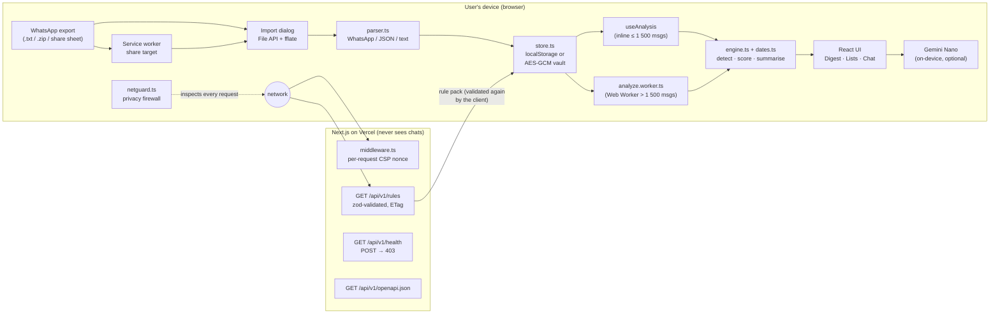

# Architecture

Sift is a **local-first** web app: every step that touches a conversation runs in the user's browser. The server exists to deliver the app, publish versioned rule packs and prove (by refusing uploads) that it never needs chat data.

## System overview



## Layers

| Layer                   | Location                                                                                | Responsibility                                                                                                                       |
| ----------------------- | --------------------------------------------------------------------------------------- | ------------------------------------------------------------------------------------------------------------------------------------ |
| Presentation            | `src/components/`                                                                       | React UI. `App` composes the shell; `Sidebar`, `Digest`, `ListView`, `ConversationView`; dialogs are code-split with `next/dynamic`. |
| Application hooks       | `src/hooks/`                                                                            | `useAnalysis` (inline vs Web Worker), `useReminders` (local notifications), `useNetEvents` (firewall log).                           |
| Domain                  | `src/lib/engine.ts`, `dates.ts`, `parser.ts`, `lexicon.ts`                              | Pure, framework-free logic: parsing, deadline extraction, detection, scoring, summaries. 100 % unit-testable.                        |
| Infrastructure (client) | `src/lib/store.ts`, `vault.ts`, `netguard.ts`, `share.ts`, `calendar.ts`, `ondevice.ts` | Persistence, encryption, network inspection, file import, .ics export, on-device LLM.                                                |
| Contracts               | `src/lib/contracts.ts`                                                                  | zod schemas shared by server and client: the API is validated on **both** sides at runtime.                                          |
| Server                  | `src/server/`, `src/app/api/v1/`, `src/middleware.ts`                                   | Rate limiting, RFC 9457 errors, request IDs, rule packs, OpenAPI, CSP nonces.                                                        |
| Background              | `src/workers/`, `public/sw.js`                                                          | Analysis worker; share-target service worker.                                                                                        |

## Key design decisions

1. **Local-first processing instead of a cloud LLM.** The brief requires that conversations and summaries never leave the device. Any cloud API would violate that, so detection and scoring are deterministic and local, and the only LLM is Chrome's on-device Gemini Nano.
2. **Rules + on-device model, not model-only.** Rules are instant, explainable (every flag has a "why?") and work in every browser; Gemini Nano adds a natural-language summary where available. The model's output is sanity-checked and the app falls back to the rules engine — never to the network.
3. **A deliberately small, hardened server.** A bigger backend would mean storing user data. Instead the server offers a versioned API (`/api/v1`) with shared zod contracts, rate limiting, ETag caching, problem+json errors and an OpenAPI document; `POST /api/v1/health` always returns 403 so the in-app leak test has a real target.
4. **Web Worker above 1 500 messages.** Below that, inline analysis finishes in a few milliseconds and avoids worker start-up and copying costs; above it the worker keeps the UI responsive. Stale worker results are dropped by job id.
5. **Windowed rendering.** Chat threads render the newest 300 messages and page older ones on demand, so a 4 000-message chat opens in about 0.45 s in testing.
6. **Optional encryption at rest.** AES-256-GCM, key from PBKDF2-SHA256 (310 000 iterations), non-extractable `CryptoKey` held only in memory, fresh IV per write. Opt-in, because a forgotten passphrase means unrecoverable data.
7. **Defence in depth against leaks.** Even if a dependency tried to exfiltrate data: the privacy firewall blocks requests containing chat text, and the CSP (`connect-src 'self'`) stops connections to any other origin.
8. **Code-split dialogs and lazily-loaded validation.** Settings, Profile, Privacy and Import (which bundles the zip library) load only when opened; zod is loaded only when a rule pack is validated. This keeps first-load JS for `/` at 138 kB; without splitting it measured 164 kB.

## API (v1)

| Method & path                            | Purpose                                        | Responses                              |
| ---------------------------------------- | ---------------------------------------------- | -------------------------------------- |
| `GET /api/v1/rules?pack=en\|en+hinglish` | Detection rule pack for the on-device engine   | 200 (ETag), 304, 400 problem+json, 429 |
| `GET /api/v1/health`                     | Liveness, API and rules version, uptime        | 200, 429                               |
| `POST /api/v1/health`                    | Always refused — the server accepts no content | 403 problem+json                       |
| `GET /api/v1/openapi.json`               | OpenAPI 3.1 description of the API             | 200                                    |
| `/api/rules`, `/api/health`              | Legacy paths                                   | 308 → `/api/v1/…`                      |

Every API response carries `RateLimit-Limit`, `RateLimit-Remaining`, `RateLimit-Reset` and `X-Request-Id`. The limiter is an in-memory sliding window (60 requests/min per IP, per server instance), which is appropriate because the API only serves small public, cacheable data.

## Data model

```ts
Conversation { id, name, source, messages: Message[], lastReadIndex, pinned? }
Message      { id, author, text, ts }
Insight      { key, kinds[], score 0–100, priority, reasons[], due?, forMe, answered, unread }
ItemState    { done?, dismissed?, snoozedUntil? }   // per insight, keyed "convId:msgId"
```

Insights are **derived, never stored**: they are recomputed from conversations + item state, so changing the profile, rules or time updates every score consistently.
